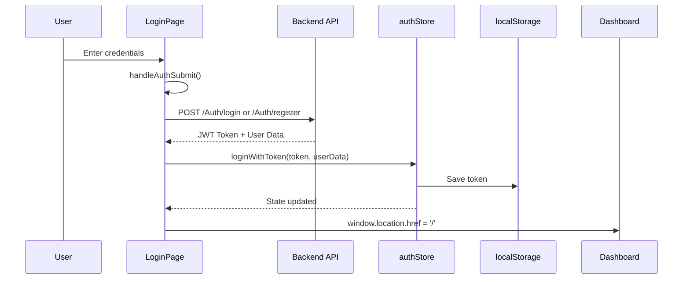

# Authentication Module

## Overview

The Authentication Module handles user authentication including login, registration, session management, and route protection. It uses JWT tokens for stateless authentication and Zustand for state management.

## Files

| File | Purpose |
|------|---------|
| [`src/pages/LoginPage.tsx`](../../src/pages/LoginPage.tsx:1) | Login/Registration UI |
| [`src/components/auth/AuthGuard.tsx`](../../src/components/auth/AuthGuard.tsx:1) | Route protection component |
| [`src/services/authService.ts`](../../src/services/authService.ts:1) | Authentication API service |
| [`src/store/authStore.ts`](../../src/store/authStore.ts:1) | Authentication state management |
| [`src/utils/auth.ts`](../../src/utils/auth.ts:1) | Authentication utilities |

---

## LoginPage Component

### [`LoginPage.tsx`](../../src/pages/LoginPage.tsx:1) - Full Page Component

**Purpose**: Provides login and registration forms with a beautiful split-screen design.

### Visual Design

```
┌─────────────────────────────────────────────────────────────────┐
│                    LOGIN / REGISTER PAGE                        │
├────────────────────────────┬────────────────────────────────────┤
│                            │                                    │
│  [Brand Button]            │   ┌────────────────────────────┐  │
│                            │   │     Task Review Widget      │  │
│  ┌────────────────────┐    │   └────────────────────────────┘  │
│  │                    │    │                                    │
│  │  Welcome back /    │    │   ┌────────────────────────────┐  │
│  │  Create account    │    │   │                            │  │
│  │                    │    │   │     Background Image       │  │
│  │  [Email Input]     │    │   │     with Overlay            │  │
│  │  [Password Input]  │    │   │                            │  │
│  │                    │    │   │   ┌────────────────────┐   │  │
│  │  [Forgot Password] │    │   │   │  Calendar Widget   │   │  │
│  │                    │    │   │   └────────────────────┘   │  │
│  │  [Sign In Button]  │    │   │                            │  │
│  │                    │    │   │   ┌────────────────────┐   │  │
│  └────────────────────┘    │   │   │  Avatar Stack      │   │  │
│                            │   └────────────────────────────┘  │
│  [Sign up link / Terms]    │                                    │
│                            │                                    │
└────────────────────────────┴────────────────────────────────────┘
```

### State Management

```typescript
const [authMode, setAuthMode] = useState<'login' | 'register'>('login');
const [showPassword, setShowPassword] = useState(false);
const [authError, setAuthError] = useState('');
const [isLoading, setIsLoading] = useState(false);
const [email, setEmail] = useState('');
const [password, setPassword] = useState('');
const [fullName, setFullName] = useState('');
```

### Authentication Flow



### Form Handling

```typescript
const handleAuthSubmit = async (e: React.FormEvent) => {
  e.preventDefault();
  setIsLoading(true);
  setAuthError('');
  
  try {
    const endpoint = authMode === 'login' ? '/Auth/login' : '/Auth/register';
    const payload = authMode === 'login' 
      ? { email, password } 
      : { userName: fullName, email, password };

    const res = await fetch(`${API_BASE_URL}${endpoint}`, {
      method: 'POST',
      headers: { 'Content-Type': 'application/json' },
      body: JSON.stringify(payload)
    });

    if (res.ok) {
      const receivedToken = data.token || data.Token || data.jwt;
      loginWithToken(receivedToken, {
        email: data.email,
        userName: data.userName,
        role: data.role
      });
      window.location.href = '/';
    } else {
      // Parse error messages
    }
  } catch (error) {
    setAuthError('Server is not reachable...');
  }
};
```

### Key Features

1. **Dual Mode**: Toggle between login and register
2. **Password Visibility**: Toggle show/hide password
3. **Error Handling**: Display detailed error messages
4. **Loading States**: Disable button during submission
5. **Visual Feedback**: Loading spinner on submit button

---

## AuthGuard Component

### [`AuthGuard.tsx`](../../src/components/auth/AuthGuard.tsx:1)

**Purpose**: Protects routes by checking authentication and role-based access.

### Component Signature

```typescript
interface AuthGuardProps {
  children: React.ReactNode;
  allowedRoles?: Role[];
}
```

### Protection Logic

```
┌─────────────────────────────────────────┐
│           AuthGuard Check Flow          │
├─────────────────────────────────────────┤
│                                         │
│  1. Is user authenticated?              │
│     ├─ NO  → Redirect to /login         │
│     └─ YES ↓                            │
│                                         │
│  2. Are allowedRoles defined?           │
│     ├─ NO  → Allow access               │
│     └─ YES ↓                            │
│                                         │
│  3. Does user's role match?             │
│     ├─ NO  → Redirect to /             │
│     └─ YES → Render children            │
│                                         │
└─────────────────────────────────────────┘
```

### Usage Examples

```tsx
// Require authentication only
<AuthGuard>
  <Dashboard />
</AuthGuard>

// Require specific roles
<AuthGuard allowedRoles={['SuperAdmin', 'HRAdmin']}>
  <PayrollPage />
</AuthGuard>

// SuperAdmin only
<AuthGuard allowedRoles={['SuperAdmin']}>
  <UsersPage />
</AuthGuard>
```

### Role Definitions

```typescript
type Role = 'SuperAdmin' | 'HRAdmin' | 'Manager' | 'Employee';
```

| Role | Access Level | Description |
|------|--------------|-------------|
| SuperAdmin | Full | Complete system access |
| HRAdmin | High | HR management features |
| Manager | Medium | Team management features |
| Employee | Basic | Self-service features |

---

## Auth Service

### [`authService.ts`](../../src/services/authService.ts:1)

**Purpose**: Provides API methods for authentication operations.

### API Endpoints

| Method | Endpoint | Description |
|--------|----------|-------------|
| POST | `/auth/login` | User login |
| POST | `/auth/register` | User registration |
| POST | `/auth/logout` | User logout |
| GET | `/users/me` | Get current user |

### Service Methods

```typescript
export const authService = {
    // POST /api/v1/auth/login
    login: async (credentials: LoginRequest): Promise<AuthResponse> => {
        const response = await api.post<ApiResponse<AuthResponse>>('/auth/login', credentials);
        if (!response.data.success || !response.data.data) {
            throw new Error(response.data.message || 'Login failed');
        }
        return response.data.data;
    },

    // POST /api/v1/auth/register
    register: async (data: RegisterRequest): Promise<AuthResponse> => {
        const response = await api.post<ApiResponse<AuthResponse>>('/auth/register', data);
        if (!response.data.success || !response.data.data) {
            throw new Error(response.data.message || 'Registration failed');
        }
        return response.data.data;
    },

    // POST /api/v1/auth/logout
    logout: async (): Promise<void> => {
        const refreshToken = localStorage.getItem('ems-refresh-token');
        if (!refreshToken) return;
        await api.post('/auth/logout', { refreshToken });
    },

    // GET /api/v1/users/me
    getMe: async (): Promise<UserProfile> => {
        const response = await api.get<ApiResponse<UserProfile>>('/users/me');
        if (!response.data.success || !response.data.data) {
            throw new Error(response.data.message || 'Failed to fetch profile');
        }
        return response.data.data;
    },
};
```

### Response Types

```typescript
// Authentication DTOs
export interface LoginRequest {
    email: string;
    password: string;
}

export interface RegisterRequest {
    userName: string;
    email: string;
    password: string;
}

export interface AuthResponse {
    accessToken: string;
    refreshToken: string;
    userName: string;
    email: string;
    role: string;
    accessTokenExpiresAt: string;
    refreshTokenExpiresAt: string;
}

export interface UserProfile {
    id: number;
    userName: string;
    email: string;
    role: string;
    isActive: boolean;
    isEmailVerified: boolean;
    createdAt: string;
    lastLogin: string | null;
    isLockedOut: boolean;
}
```

---

## Auth Store

### [`authStore.ts`](../../src/store/authStore.ts:1)

**Purpose**: Manages authentication state using Zustand with persistence.

### State Interface

```typescript
interface AuthState {
  user: User | null;
  token: string | null;
  isAuthenticated: boolean;
  isLoading: boolean;
  error: string | null;
  login: (email: string, password: string) => Promise<boolean>;
  loginWithToken: (token: string, userData: {...}) => boolean;
  logout: () => void;
  switchRole: (role: Role) => void;
  clearError: () => void;
}
```

### User Type

```typescript
interface User {
  id: string;
  email: string;
  name: string;
  role: Role;
  avatar?: string;
  departmentId?: string;
}
```

### Persistence Configuration

```typescript
export const useAuthStore = create<AuthState>()(
  persist(
    (set) => ({ /* state and actions */ }),
    { name: 'ems-auth' }  // localStorage key
  )
);
```

### Key Actions

```typescript
// Login with email/password
login: async (email: string, password: string) => {
  set({ isLoading: true, error: null });
  try {
    const response = await authService.login(email, password);
    localStorage.setItem('ems-token', response.token);
    const user: User = {
      id: '1',
      email: response.email,
      name: response.userName,
      role: response.role as Role,
    };
    set({ user, token: response.token, isAuthenticated: true });
    return true;
  } catch (error) {
    set({ error: errorMessage, isLoading: false });
    return false;
  }
},

// Login with token (no API call)
loginWithToken: (token: string, userData: {...}) => {
  localStorage.setItem('ems-token', token);
  const user: User = {
    id: '1',
    email: userData.email,
    name: userData.userName,
    role: userData.role as Role,
  };
  set({ user, token, isAuthenticated: true });
  return true;
},

// Logout
logout: () => {
  localStorage.removeItem('ems-token');
  set({ user: null, token: null, isAuthenticated: false, error: null });
},
```

---

## Auth Utilities

### [`auth.ts`](../../src/utils/auth.ts:1)

**Purpose**: Utility functions for authentication-related operations.

```typescript
// Current implementation placeholder
// Can be extended with functions like:
// - getTokenExpiry()
// - isTokenValid()
// - refreshToken()
// - decodeToken()
```

---

## Token Management

### Storage
- Token stored in localStorage under key: `ems-token`
- Auth state persisted in localStorage under key: `ems-auth`

### API Integration
- Axios interceptor automatically adds token to all requests
- Token sent as `Authorization: Bearer <token>` header

### Error Handling
- 401 responses trigger automatic logout
- User redirected to `/login` on 401

---

## Security Considerations

1. **HTTPS Only**: Should be deployed over HTTPS
2. **Token Storage**: Tokens stored in localStorage (consider httpOnly cookies for enhanced security)
3. **Auto-logout**: 401 responses trigger immediate logout
4. **Role Validation**: Both frontend and backend validate roles

---

## Related Documentation

- [Core Application Module](../Core/Core_Application_Module.md)
- [Layout Module](../Layout/Layout_Module.md)
- [Stores Module](../Foundation/Stores_Module.md)
- [Services Module](../Foundation/Services_Module.md)

---

*Last Updated: 2026-03-31*
