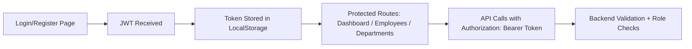

# EmployeeManagementUI (Frontend)

Modern single-page frontend for the Employee Management System, built with vanilla JavaScript and Tailwind CSS, consuming a secure JWT-protected ASP.NET Core backend.

---

## Live Frontend URL

https://employes-management-system-ui.vercel.app/

---

## Highlights

- SPA experience with hash-based routing (`#/login`, `#/dashboard`, etc.)
- Clean modular structure: config, API client, auth, router, pages, reusable components
- Role-aware UI behavior (`Admin` vs `User`) aligned with backend authorization rules
- Reusable modal and data table components for maintainable CRUD screens
- Vercel-ready deployment with static hosting and rewrite configuration

---

## Tech Stack

| Area | Technology |
|---|---|
| UI | HTML5 + Tailwind CSS (CDN) |
| Logic | Vanilla JavaScript (ES6 style, modular file organization) |
| Routing | Hash-based SPA router |
| Auth State | LocalStorage (JWT, username, role) |
| API Integration | `fetch` wrapper with centralized error handling |
| Hosting | Vercel |

---

## Application Flow



---

## Folder Structure

```text
EmployeeManagementUI/
├── index.html
├── css/
│   └── style.css
├── js/
│   ├── config.js
│   ├── api.js
│   ├── auth.js
│   ├── router.js
│   ├── utils.js
│   ├── components/
│   │   ├── sidebar.js
│   │   ├── topbar.js
│   │   ├── statsCard.js
│   │   ├── dataTable.js
│   │   └── modal.js
│   └── pages/
│       ├── login.js
│       ├── register.js
│       ├── dashboard.js
│       ├── employees.js
│       └── departments.js
├── vercel.json
└── vercel-deployment-guide.md
```

---

## Route Map

- `#/login`
- `#/register`
- `#/dashboard`
- `#/employees`
- `#/departments`

Auth guards are implemented in `js/router.js`:
- Unauthenticated users are redirected to login
- Authenticated users are redirected away from login/register to dashboard

---

## Configuration

Primary runtime setting in `js/config.js`:

```js
API_BASE_URL: "https://emp-mgmt-api.runasp.net/api"
```

LocalStorage keys used:
- `ems_token`
- `ems_username`
- `ems_role`

---

## Key Frontend Features

- Login and registration with loading/error UX states
- Dashboard with live metrics and recent hires
- Employees management:
  - list + search
  - add/edit/delete via modal
  - role-based action visibility
- Departments management:
  - list + search
  - add/edit/delete via modal
  - conflict-friendly feedback when delete is blocked by assigned employees

---

## API Integration Notes

All requests go through `js/api.js`:
- Automatically attaches JWT (`Authorization: Bearer <token>`) when available
- Handles `401 Unauthorized` by clearing session and redirecting to login
- Normalizes API error handling for page modules

---

## Run Locally

Use a local static server (recommended):

```bash
python -m http.server 5500 --directory EmployeeManagementUI
```

Open:

`http://localhost:5500/index.html#/login`

---

## Deploy to Vercel

This project includes `vercel.json` and is deployment-ready.

Key setting when importing monorepo:
- **Root Directory** = `EmployeeManagementUI`

Detailed steps:

[`vercel-deployment-guide.md`](./vercel-deployment-guide.md)

---

## Troubleshooting

### Frontend still calling localhost API
- Confirm `js/config.js` has live API URL
- Hard refresh browser (`Ctrl + F5`)

### Unauthorized after switching environments
- Clear browser storage:

```js
localStorage.clear();
```

- Login again

### Blank screen / route issue
- Ensure app is opened via a server URL (not file path)
- Check browser DevTools Console for script errors

---

## Enterprise Readiness (Next Iteration)

- Move runtime config to environment-driven strategy
- Add form schema validation helpers
- Add component-level unit testing
- Add telemetry/analytics and UX event tracking
